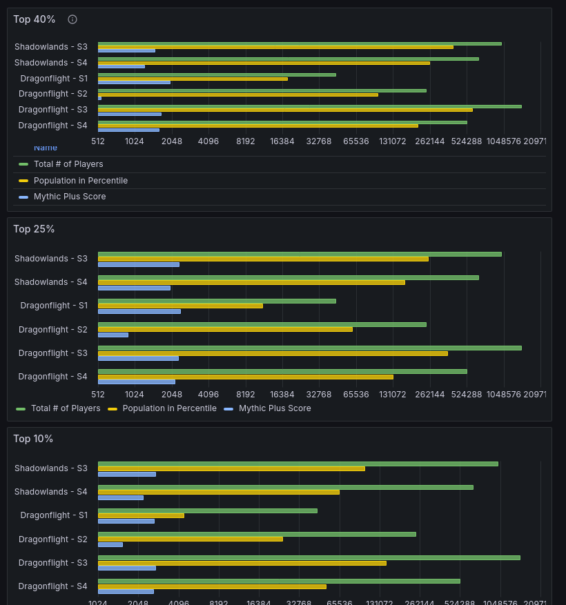
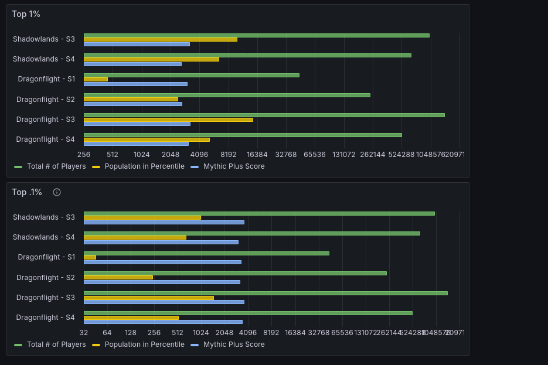
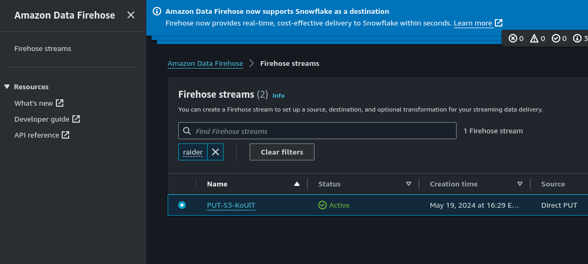
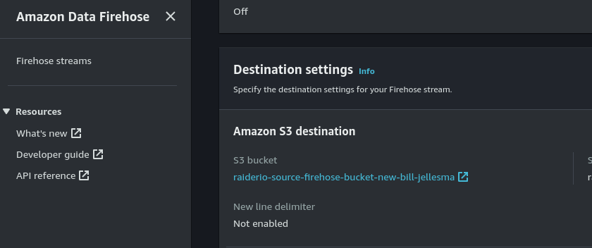
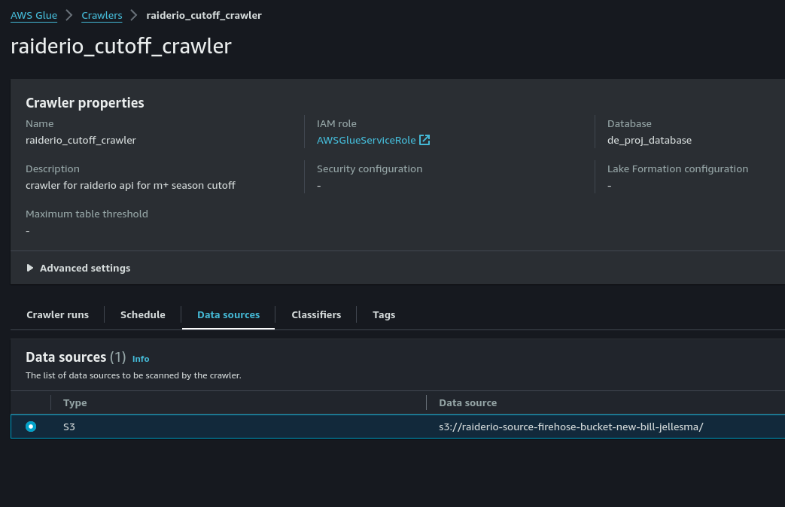

# Raiderio Data

## Overview

**Raiderio Data** leverages serverless technology to systematically ingest and analyze World of Warcraft mythic plus scores from top players over the years. Utilizing the [Raider.io API](https://raider.io/api) and AWS services, this project delivers key insights into player rankings across various percentiles.

This project was constructed following the principles outlined in [David Freitag's Build Your First Serverless Data Engineering Project](https://maven.com/david-freitag/first-serverless-de-project), focusing on practical, hands-on application of data engineering techniques in a serverless environment.

## Features
- **Data Ingestion**: Automatically pull data from the Raider.io API using AWS Lambda functions.
- **ETL Process**: Transform the ingested data through a robust AWS Glue workflow.
- **Data Visualization**: Analyze and visualize the processed data using [Grafana](https://grafana.com/) to track and compare player scores across different times and seasons.

## Questions Addressed
- What score is required to be in the top 40%, 25%, 10%, 1%, and 0.1% of players for the current season?
- How have the requirements for these percentiles changed since raiderio's tracking of mythic plus scores began?

## Architecture
1. We use AWS Lambda to call the raiderio api and dump the data to a firehose
2. Firehose will dump the data received to an S3 Bucket after a certain amount of time
3. An AWS Glue Data Workflow will kick off the following crawlers and jobs 
    * A crawler will use the data from the S3 bucket to create a table in AWS Athena
    * A job `Delete Raiderio Table` will delete any raiderio temporary and production tables as well as empty the S3 bucket that the crawler used
    * A job `Create Raiderio Table` will recreate the raiderio temporary table with the table data created from crawler
    * A job `Data Quality Raiderio Table` will perform an out of range check on the temporary table to ensure the integrity of the data
    * A job `Publish Raiderio Table` will capture the transformed data from the temporary table and push it to a production ready table that can be used with Grafana
4. Grafana will be used to visualize the data created from the production table. See the snapshots below.

## Data Visualization

Here is a [snapshot](https://bjellesma.grafana.net/dashboard/snapshot/aoe0YpBmrCmVUFaQ6as03Wz4i6cEewC3?orgId=0) of the data on Grafana as of May 27, 2024

## Findings

Dragonflight Season 3 has the highest cutoff points both for its own expansion and for the overall available data for the top 10%, top 1%, and top 0.1% of the playerbase. However, Dragonflight Season 3 is overtaken by Dragonflight Season 1 for the top 40% and top 25%. A possible reason for this is the PUGs (pick up groups) tend to be more common at the 40% and 25% marks and usually have less coordination implying that the Dragonflight season 1 dungeon pool may have required less coordination allowing the player base to achieve higher scores. Additionally, players in the top 10%, 1%, and 0.1% tend to be in organized groups (often in voice chats) where coordination is much higher. This increased group coordination often leads to success in higher level dungeons.

Notably, Dragonflight Season 2 also has very low score cutoffs until the top 1% of the playerbase. This could be due to an increase population count as season 2 launched (season 1 was very successful for Blizzard which could have attracted more players) and this increased population could be players that aren't looking to maximize their scores. This influx to the population could have led to a decreased score needed to place in the top percentiles.

## Getting Started
To get started with this project, you'll need to set up several AWS services. Here's a brief rundown of the steps:

1. **Clone the repository**:  
   `git clone https://github.com/bjellesma/raiderio-data.git`
2. **Configure AWS Services**:
    - Create the following AWS S3 Buckets. Ensure these buckets are globally unique. The names generated must be mapped to the parameters listed in the AWS Systems Manager Parameter Store below.
        - Data Quality bucket
            - This will map to `raiderio_data_quality_bucket`
            - This will hold all information on the data quality checks
        - Production Data bucket
            - This will map to `raiderio_prod_bucket`
            - This will hold all of the data for our production Athena table
        - Temporary Data bucket
            - This will map to `raiderio_temp_bucket`
            - This will hold all of the data for our temporary (pre-transformed) Athena table
        - Query Results bucket
            - This will map to `raiderio_query_results_bucket`
            - This will be used during glue jobs to hold all query results
        - Firehose bucket
            - This does not map to any of the below parameters
            - This will be used as the destination bucket for the AWS Kinesis Firehose
    - AWS Kinesis Firehose
        - The firehose name that is automatically generated by AWS will be used in the below parameters in `raiderio_firehose_name`
        
        - The destination setting S3 bucket will be the Firehose bucket that you created above. We will use this in the crawler that we create below.
        
    - Create an AWS glue crawler that will use the bucket that the firehose has dumped into to create a database table using AWS Athena
    
    - Create the following parameters in AWS Systems Manager Parameter Store
        - `raiderio_database`: This will be the name of the database that you created in AWS Athena
        - `raiderio_data_quality_bucket` The AWS S3 bucket that the data quality glue job will create files in
        - `raiderio_firehose_name`: The AWS Kinesis Firehose that the lambda function will use to hold files
        - `raiderio_firehose_table`: The AWS athena table that you've set as the destination for your kinesis firehose
        - `raiderio_partition_column`: The column of the AWS temporary and production tables to be the partition
        - `raiderio_prod_bucket`: The S3 bucket to store data in parquet format for the production table in AWS Athena
        - `raiderio_prod_table`: The name of the production table that you want the glue job `Publish Raiderio Table` to create
        - `raiderio_temp_bucket`: The S3 bucket to store data in parquet format for the temporary table in AWS Athena
        - `raiderio_temp_table`: The name of the temporary table that you want the glue job `Create Raiderio Table` to create
        - `raiderio_query_results_bucket`: The S3 bucket to store the query results being performed by the glue jobs
   - Set up AWS Lambda to ingest data from Raider.io using the files in the [lambda-api-call](https://github.com/bjellesma/raiderio-data/tree/main/lambda-api-call) directory.
    - This firehose will dump all files collected by the lambda function to the `raiderio_firehose_bucket`
   - Configure AWS Glue for the ETL process.
    - Create a glue job called `Create Raiderio Table` using [create_raiderio_table.py](https://github.com/bjellesma/raiderio-data/blob/main/raiderio-glue-jobs/create_raiderio_table.py)
    - Create a glue job called `Delete Raiderio Table` using [delete_raiderio_table.py](https://github.com/bjellesma/raiderio-data/blob/main/raiderio-glue-jobs/delete_raiderio_table.py)
    - Create a glue job called `Data Quality Raiderio Table` using [data_quality_raiderio_table.py](https://github.com/bjellesma/raiderio-data/blob/main/raiderio-glue-jobs/data_quality_raiderio_table.py)
    - Create a glue job called `Publish Raiderio Table` using [create_raiderio_table.py](https://github.com/bjellesma/raiderio-data/blob/main/raiderio-glue-jobs/publish_raiderio_table.py)
3. Set up Grafana for visualization. Create a dashboard with the following panels
    - All scales are bar charts with a logarithmic x axis in order to see the numbers better
    - Top 40% Panel will be a bar chart using the [Top 40% Query](https://github.com/bjellesma/raiderio-data/blob/main/grafana-queries/top40.sql)
    - Top 25% Panel will be a bar chart using the [Top 25% Query](https://github.com/bjellesma/raiderio-data/blob/main/grafana-queries/top25.sql)
    - Top 10% Panel will be a bar chart using the [Top 10% Query](https://github.com/bjellesma/raiderio-data/blob/main/grafana-queries/top10.sql)
    - Top 1% Panel will be a bar chart using the [Top 1% Query](https://github.com/bjellesma/raiderio-data/blob/main/grafana-queries/top1.sql)
    - Top 0.1% Panel will be a bar chart using the [Top 0.1% Query](https://github.com/bjellesma/raiderio-data/blob/main/grafana-queries/toppoint1.sql)

## License
This project is licensed under the MIT License - see the [LICENSE](LICENSE.md) file for details.

## Acknowledgments
- Special thanks to [David Freitag](https://github.com/dkfreitag) for his invaluable guidance through his course.
- Raider.io for providing an accessible API to work with World of Warcraft data.